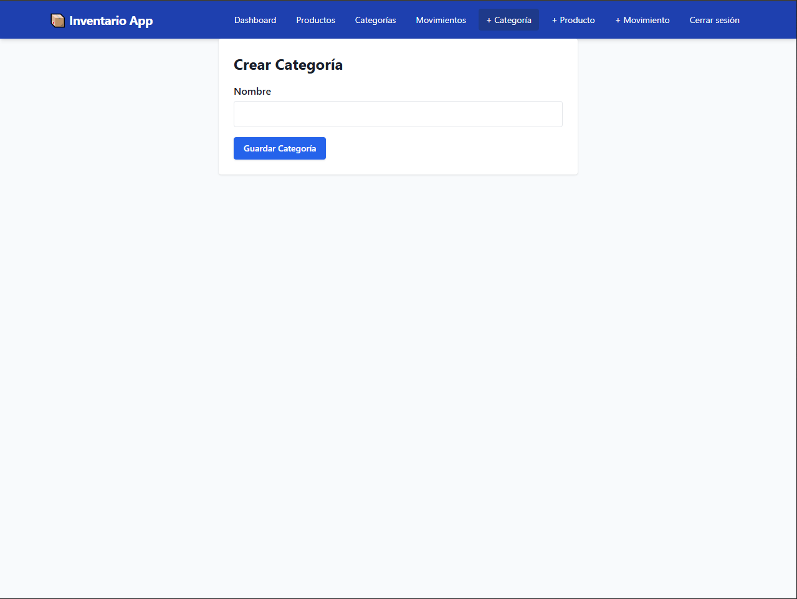

# Proyecto Final - Sistema de Inventario

**Materia:** Programación 3
**Alumno:** Luciano Parrotta

---

## Preparación del Entorno de Desarrollo

1. **Clonar el Repositorio:**

   ```bash
   git clone https://github.com/lucianoParrotta/Proyecto-Final-Prog3.git
   cd Proyecto-Final-Prog3-main
   ```

2. **Configurar Variables de Entorno:** Crear un archivo `.env` dentro de la carpeta `backend/` con el siguiente contenido:

   ```env
   JWT_SECRET=secreto123
   DB_HOST=database
   DB_USER=postgres
   DB_PASSWORD=postgres
   DB_NAME=inventario
   DB_PORT=5432
   ```

3. **Instalación de Dependencias:** Docker se encargará automáticamente de instalar todas las dependencias en los contenedores.

4. **Levantar los Contenedores:**

   ```bash
   docker-compose up --build
   ```

5. **Cargar Datos Iniciales:** En otra terminal:

   ```bash
   docker-compose exec backend npx sequelize-cli db:seed:all
   ```

---

## Credenciales de Acceso

- **Usuario:** `admin@empresa.com`
- **Contraseña:** `Admin2025!`

Estas credenciales están preconfiguradas y precargadas en el formulario de inicio de sesión para facilitar la corrección.

---

## Endpoints Principales

### Autenticación

- `POST /api/auth/login` — Inicia sesión y devuelve un token JWT.

### Categorías

- `GET /api/categories` — Listar categorías
- `POST /api/categories` — Crear nueva categoría
- `PUT /api/categories/:id` — Actualizar una categoría
- `DELETE /api/categories/:id` — Eliminar categoría

### Productos

- `GET /api/products` — Listar productos
- `POST /api/products` — Crear nuevo producto
- `PUT /api/products/:id` — Editar producto
- `DELETE /api/products/:id` — Eliminar producto

### Movimientos

- `GET /api/movements` — Listar movimientos de stock
- `POST /api/movements` — Crear entrada o salida de stock

---

## Introducción

Este proyecto consiste en el desarrollo de una aplicación web full-stack para la gestión de inventario. La plataforma permite administrar productos, categorías, movimientos de stock y usuarios con acceso autenticado.&#x20;

## Tecnologías Utilizadas

### Frontend

- React 18
- React Router DOM
- Tailwind CSS
- Axios
- React Hot Toast
- React Hook Form

### Backend

- Node.js
- Express.js
- Sequelize ORM
- PostgreSQL
- JWT (JSON Web Token)
- Bcrypt

### Infraestructura

- Docker
- Docker Compose

---

## Arquitectura General

La aplicación se divide en tres capas principales:

### 1. **Frontend (Cliente)**

- SPA construida con React y Tailwind CSS.
- Navegación con React Router.
- Comunicación con el backend mediante Axios.
- Formulario reactivo con React Hook Form.

### 2. **Backend (Servidor)**

- Servidor Express que expone una API REST.
- Controladores y rutas organizadas por módulo.
- Middleware de autenticación JWT y validación de datos.

### 3. **Base de Datos**

- PostgreSQL con Sequelize ORM.
- Migraciones y seeders para estructurar y poblar la base.

Todo el stack se ejecuta en contenedores Docker para asegurar un entorno reproducible.

---

## Funcionalidades Implementadas

### 1. **Autenticación de Usuarios**

- Login con JWT
- Middleware de autenticación para proteger rutas
- Formulario prellenado para facilitar la corrección
- Botón de "Cerrar sesión"

### 2. **Dashboard**

- Vista resumen con tarjetas de conteo
- Cálculo de stock total
- Vista de últimos movimientos

### 3. **Gestión de Categorías**

- CRUD completo
- Búsqueda en tiempo real
- Confirmación antes de eliminar

### 4. **Gestión de Productos**

- CRUD completo
- Asociación con categorías (opcional)
- Validaciones
- Búsqueda por nombre

### 5. **Movimientos de Stock**

- Alta de entradas/salidas de inventario
- Actualización de stock en productos
- Visualización en el dashboard

### 6. **Navegación Protegida**

- Acceso restringido a rutas privadas

---

## Consideraciones Adicionales

- En caso de eliminar una categoria con productos asociados, se opto por no eliminar dichos productos. Al borrar la categoria, el producto asociado dira "sin categoria", y se podra editar para asignarle una nueva categoria existente.
- Al eliminar un **producto**, también se eliminan sus movimientos asociados.
- Los datos iniciales se cargan mediante **seeders** de Sequelize.

---

## Recomendaciones para Corrección

- Al iniciar el frontend (`localhost:3000`) ir directamente al login.
- Las credenciales ya están completadas para facilitar acceso.
- Luego de iniciar sesión, se redirige al dashboard.
- Desde ahí se puede acceder a todas las secciones del sistema.

---

## Capturas de Pantalla

### Login


### Dashboard


### Productos


### Movimiento


### Crear Categoria 



### Crear Movimiento


### Crear Producto 


### Editar Producto


### Crear Categoria 


---

